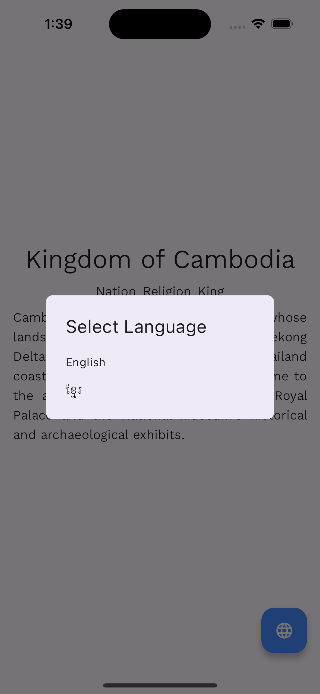

# Flutter x GetX

Here is a simple Flutter code snippet that demonstrates the usage of GetX. This code has been translated from the original example in the GetX documentation.
## pubspec.yaml
```yaml
dependencies:
  flutter:
    sdk: flutter
  get: ^4.6.6
  google_fonts: ^6.1.0
```
## Dependencies
- [GetX](https://pub.dev/packages/get)
- [Google Fonts](https://pub.dev/packages/google_fonts)

## Screenshots
|                English                |            Select Language            |                 Khmer                 |
|:-------------------------------------:|:-------------------------------------:|:-------------------------------------:|
|  |  |  |
